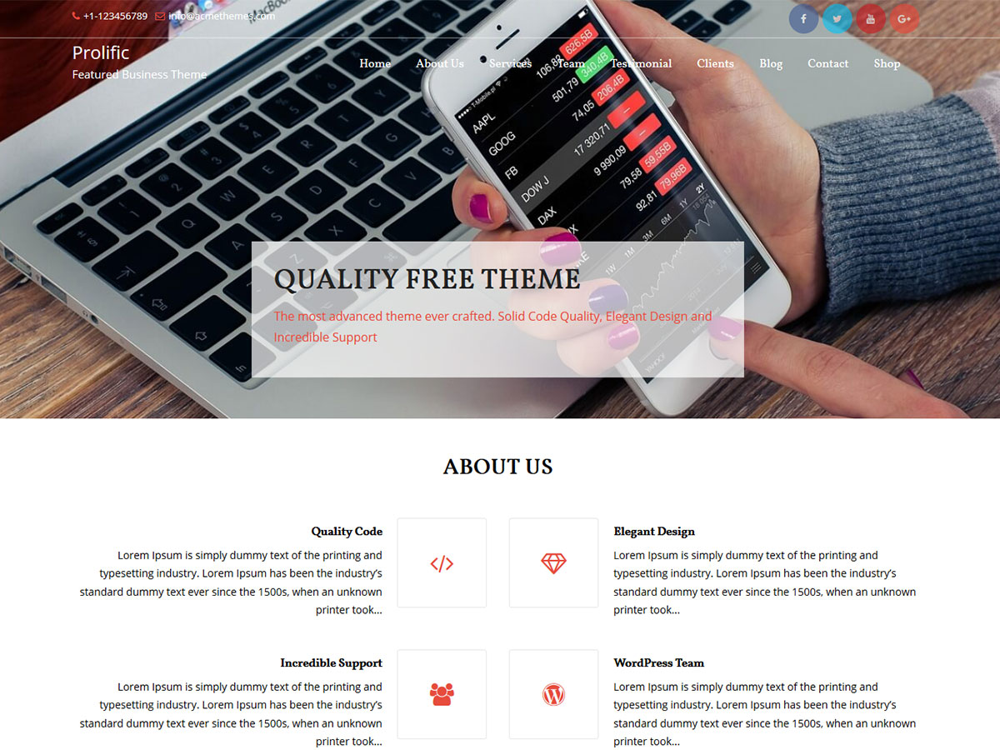

# Prolific

**Contributors:** acmethemes  
**Requires at least:** 6.6  
**Tested up to:** 7.0  
**Requires PHP:** 7.4  
**Stable tag:** 4.0.0  
**License:** GPLv2 or later  
**License URI:** https://www.gnu.org/licenses/gpl-2.0.html  

> 

Prolific is a multi-purpose WordPress theme that adapts to any business need. Whether you're running a corporate site, a creative agency, a personal blog, or an online portfolio, its clean design, quality code, and flexible customizer options make it easy to build a professional web presence.

## Features

- **Featured slider** — showcase your best content prominently
- **Up to four-column layouts** — flexible grids for any page
- **Post formats** — standard, gallery, image, video for rich content
- **WooCommerce compatible** — add e-commerce to any site
- **Custom colors & background** — brand your site instantly
- **Custom logo & menu** — full identity control
- **Footer widgets** — contact, links, social media, and more
- **Full-width template** — impactful landing pages
- **Related posts** — increase engagement on blog content
- **Breadcrumb navigation** — clear path for visitors and search engines
- **Translation ready** — .pot file included
- **RTL support** — right-to-left language compatible
- **Responsive** — looks great on all screen sizes

## Installation

1. Download the theme zip file.
2. In your WordPress admin, go to **Appearance → Themes**.
3. Click **Add New** → **Upload Theme**.
4. Select the zip file and click **Install Now**.
5. Click **Activate**.

## Frequently Asked Questions

### How do I install the theme?

In your admin panel, go to **Appearance → Themes**, click **Add New**, upload the zip file, and click **Activate**.

### How do I customize the theme?

Go to **Appearance → Customize** — all theme options are available there, from layout and colors to featured content and widgets.

## Credits

Prolific is built on [Underscores](https://underscores.me/) and licensed under GPLv2 or later. It bundles the following third-party resources:

- [Google Fonts](https://fonts.google.com/) — Apache License 2.0
- [Font Awesome](https://fontawesome.com/) — MIT / SIL OFL 1.1
- [normalize.css](https://necolas.github.io/normalize.css/) — MIT
- [Bootstrap](http://getbootstrap.com/) — MIT
- [Theia Sticky Sidebar](https://github.com/WeCodePixels/theia-sticky-sidebar) — MIT
- [Breadcrumb Trail](https://github.com/justintadlock/breadcrumb-trail) — GPLv2+
- [TGM Plugin Activation](http://tgmpluginactivation.com/) — GPLv2+
- [html5shiv](https://github.com/afarkas/html5shiv) — MIT
- [Respond.js](https://github.com/scottjehl/Respond) — MIT

---

[Demo](http://www.acmethemes.com/demo/?theme=prolific) &middot; [Support](https://www.acmethemes.com/supports/) &middot; [Acme Themes](https://www.acmethemes.com)
